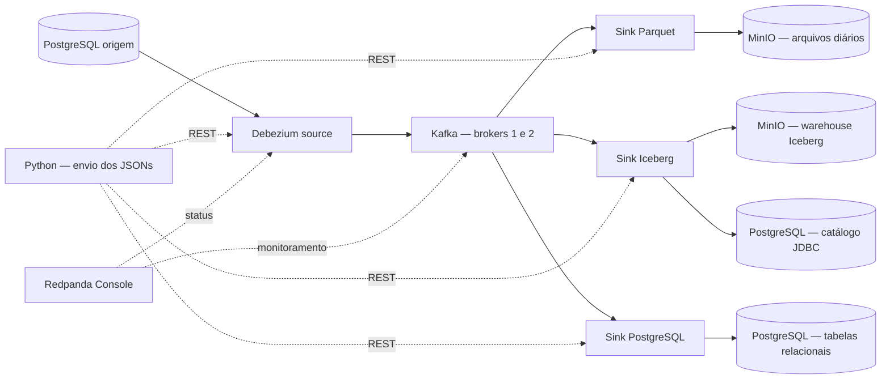

# 🧩 Laboratório CDC — Kafka, Debezium, PostgreSQL e MinIO

Pipeline de estudo que captura mudanças de um banco relacional e as distribui para **Parquet diário**, **tabelas Apache Iceberg** e **outro PostgreSQL**. Dois brokers Kafka armazenam os eventos; o Redpanda Console permite acompanhar tópicos e conectores.

As conexões são enviadas **individualmente por JSON**, usando Python. A captura e a gravação dos destinos são executadas pelo **Kafka Connect**, com Debezium na origem e um plugin Java próprio nos sinks.

<a id="menu"></a>
## 🧭 Menu de navegação

| Começar | Entender | Operar |
|---|---|---|
| [Visão geral](#visao-geral) | [Arquitetura](docs/ARQUITETURA.md) | [Interfaces e DBeaver](#interfaces) |
| [Pré-requisitos](#requisitos) | [Modelo de dados e CDC](docs/DADOS.md) | [Validação](#validacao) |
| [Execução passo a passo](#execucao) | [Conexões e sinks](docs/CONECTORES.md) | [Operação e diagnóstico](docs/OPERACAO.md) |
| [Configuração e credenciais](#configuracao) | [Dockerfiles e código](docs/DESENVOLVIMENTO.md) | [Registro de testes](docs/VALIDACAO.md) |

Também neste documento: [estrutura do projeto](#estrutura) · [limites do laboratório](#limites) · [comandos rápidos](comandos.txt).

<a id="visao-geral"></a>
## 🎯 Visão geral

| Destino | O que armazena | Organização |
|---|---|---|
| S3 / MinIO | Histórico de eventos CDC | Um Parquet por tabela e dia: `<tabela>/ano/mes/dia.parquet` |
| Apache Iceberg | Histórico CDC em tabelas v2 | Namespace `cdc`, partição diária, snapshots e catálogo JDBC |
| PostgreSQL destino | Estado atual da origem | Cinco tabelas em `public`, com as mesmas colunas, PKs e FKs |



A origem publica nos tópicos `cliente`, `produto`, `pedido`, `item_pedido` e `pagamento`. Todas as conexões aparecem na seção **Kafka Connect** do Console.

[↑ Menu](#menu)

<a id="requisitos"></a>
## 🛠️ Pré-requisitos

- Docker Engine com Docker Compose e suporte a builds multi-stage/BuildKit.
- Internet para baixar imagens, bibliotecas Maven/Python e compilar o MinIO na primeira execução.
- Aproximadamente **8 GB de RAM disponíveis**, como referência para este laboratório, e espaço para imagens e volumes.
- Host **Linux amd64**, arquitetura prevista no download atual do `rpk`.
- Portas locais disponíveis conforme a [tabela de interfaces](#interfaces).

Não é necessário instalar Python, Java, Maven ou Go no host. Os Dockerfiles preparam essas dependências.

[↑ Menu](#menu)

<a id="execucao"></a>
## 🚀 Execução passo a passo

Execute os comandos na raiz do repositório. O fluxo abaixo considera uma instalação nova, com volumes vazios.

### 1. Iniciar a infraestrutura

```bash
docker compose up
```

O terminal exibe os logs. Use outro terminal para as etapas seguintes. Se preferir executar em segundo plano, use `docker compose up -d`.

Esse comando **não registra conexões e não gera dados**. Conectores registrados em uma execução anterior retomam a atividade, pois configurações e offsets ficam persistidos no Kafka. O serviço `kafka-replicate` termina com `Exited (0)` quando conclui seu trabalho; isso é normal.

```bash
docker compose ps -a
curl -fsS http://localhost:8083/connectors
```

Espere os serviços ficarem prontos antes de enviar as conexões. Em uma instalação nova, a lista de conectores deve estar vazia.

### 2. Registrar a origem Debezium

```bash
docker compose run --rm tools python connect_debezium.py
```

O script lê [postgres-source.json](connectors/postgres-source.json), envia sua configuração ao Connect e aguarda a task. Debezium captura o conteúdo existente por snapshot inicial e continua acompanhando o WAL.

### 3. Gerar dados relacionais

```bash
docker compose run --rm tools python seed.py
```

A carga padrão gera **10.000 pedidos**, acompanhados de 1.000 clientes, 100 produtos, 20.084 itens e 10.000 pagamentos. São 41.184 linhas de negócio no total. A repetição da carga mantém os IDs existentes, sem duplicá-los.

Também é possível gerar os dados antes de registrar a origem: nesse caso, o snapshot os publicará como operações `r`. Quando a carga ocorre após um snapshot vazio, as inserções são publicadas como `c`.

### 4. Registrar os destinos desejados

Cada comando ativa uma conexão independente:

```bash
# Parquet diário no MinIO/S3
docker compose run --rm tools python connect_s3.py

# Tabelas Iceberg de histórico CDC
docker compose run --rm tools python connect_iceberg.py

# Espelho relacional no PostgreSQL destino
docker compose run --rm tools python connect_postgres.py
```

Os sinks leem desde o início disponível dos tópicos quando seus grupos ainda não têm offsets. As tabelas Iceberg são criadas ao receber os primeiros eventos; as tabelas relacionais dos dois PostgreSQLs são criadas na inicialização dos volumes.

### 5. Simular mudanças e verificar

```bash
docker compose run --rm tools python mutate.py
docker compose run --rm tools python verify.py --require-operations c,u,d
```

A verificação padrão exige os **três sinks**. Se ativou somente alguns, selecione-os:

```bash
docker compose run --rm tools python verify.py --destinations s3,iceberg
docker compose run --rm tools python verify.py --destinations postgres
```

`mutate.py` demonstra INSERT, UPDATE e DELETE. O histórico guarda essas operações; o espelho PostgreSQL aplica as mudanças nas tabelas correspondentes.

### 6. Consultar o Iceberg

```bash
docker compose run --rm tools python query_iceberg.py pedido --limit 5
```

O comando lê pelo catálogo Iceberg, informa versão, snapshots, particionamento e quantidade de eventos, e mostra até cinco linhas. Registre o sink Iceberg e espere a chegada dos dados antes de executar a consulta.

[↑ Menu](#menu)

<a id="configuracao"></a>
## ⚙️ Configuração e credenciais

O projeto usa três fontes de configuração com funções diferentes:

| Arquivo | Responsabilidade |
|---|---|
| `.env` | Valores que o Compose interpola: portas, credenciais MinIO e quantidade de pedidos |
| [compose.yaml](compose.yaml) | Serviços, rede, volumes, healthchecks e credenciais PostgreSQL atualmente fixas |
| [connectors/](connectors/) | JSON de cada conexão: origem, S3, Iceberg e PostgreSQL destino |

Para criar um `.env` em outra instalação, sem sobrescrever um arquivo existente:

```bash
cp -n .env.example .env
```

As credenciais locais padrão são:

| Serviço | Usuário | Senha | Banco / bucket |
|---|---|---|---|
| PostgreSQL origem e destino | `estudo` | `estudo` | `loja` |
| MinIO | `estudo` | `estudo-minio-local` | `cdc-loja` |

**As variáveis `POSTGRES_USER`, `POSTGRES_PASSWORD` e `POSTGRES_DB`, se presentes no `.env`, ainda não são interpoladas pelo Compose atual.** Para alterar essas credenciais, ajuste o Compose, os DSNs das ferramentas e os JSONs da origem, do sink PostgreSQL e do catálogo Iceberg. Alterar o Compose também não muda automaticamente as credenciais de um banco já inicializado em um volume.

Os JSONs não recebem substituição automática das variáveis do `.env`. Ao alterar usuário/senha do MinIO, atualize também `s3.access-key-id` e `s3.secret-access-key` nos dois JSONs de armazenamento. Ao alterar `S3_BUCKET`, ajuste `s3.bucket` e o bucket de `catalog.warehouse` nesses arquivos.

O `.env` está ignorado pelo Git. As credenciais documentadas são as de exemplo do laboratório; não inclua segredos reais nos arquivos versionados.

Detalhes dos campos: [guia de conectores](docs/CONECTORES.md#configuracao).

[↑ Menu](#menu)

<a id="interfaces"></a>
## 🖥️ Interfaces, portas e DBeaver

| Serviço | Endereço no host | Endereço entre containers |
|---|---|---|
| Redpanda Console | [localhost:8080](http://localhost:8080) | `redpanda-console:8080` |
| Kafka Connect / Debezium | [localhost:8083/connectors](http://localhost:8083/connectors) | `connect:8083` |
| MinIO — console web | [localhost:19001](http://localhost:19001) | `minio:9001` |
| MinIO — API S3 | `http://localhost:19000` | `http://minio:9000` |
| PostgreSQL origem | `localhost:15433` | `postgres:5432` |
| PostgreSQL destino | `localhost:5434` | `postgres-destino:5432` |
| Kafka broker 1 | `localhost:9092` | `kafka:19092` |
| Kafka broker 2 | `localhost:9093` | `kafka2:19092` |

No **DBeaver**, crie duas conexões do tipo PostgreSQL, usando banco `loja`, usuário `estudo`, senha `estudo` e as portas da tabela. Clique em **Testar conexão** e aceite o download do driver, se solicitado.

Em ambos os bancos, abra `Schemas → public → Tables` para encontrar as cinco tabelas relacionais. No destino, `cdc.inbox` é uma estrutura auxiliar de aplicação dos eventos. O catálogo JDBC Iceberg também usa esse banco, mas as linhas das tabelas Iceberg estão no MinIO e devem ser consultadas por um cliente Iceberg. O namespace Iceberg `cdc` não transforma seus arquivos em tabelas SQL de negócio do PostgreSQL.

[↑ Menu](#menu)

<a id="validacao"></a>
## ✅ Validação dos resultados

[verify.py](app/verify.py) lê os eventos Kafka até os offsets observados no início da conferência e compara seu conteúdo com os destinos selecionados. Também confere brokers, replicação, ISR e status dos conectores.

| Conferência | Critério |
|---|---|
| Parquet | Layout diário, conteúdo dos eventos esperados e ausência de offsets duplicados |
| Iceberg | Tabelas v2, snapshot, particionamento, conteúdo dos eventos e ausência de duplicatas |
| PostgreSQL | Todas as colunas/linhas das cinco tabelas iguais à origem e inbox sem pendências |
| Infraestrutura | Dois brokers, réplicas/ISR 1 e 2 nos tópicos monitorados, Console acessível e tasks ativas |

Mesmo com `--destinations postgres`, a verificação atual consulta o Redpanda Console. Esse serviço precisa estar acessível.

O [registro de validação](docs/VALIDACAO.md) descreve os testes anteriores, incluindo replay. Esses resultados são evidências de uma execução específica, não uma afirmação de que os serviços estão ativos neste momento.

[↑ Menu](#menu)

<a id="estrutura"></a>
## 📁 Estrutura do projeto

```text
.
├── README.md                     # Entrada e navegação
├── comandos.txt                  # Sequência operacional resumida
├── compose.yaml                  # Infraestrutura Docker
├── .env.example                  # Variáveis suportadas pelo Compose
├── app/                          # Ferramentas Python
│   ├── connect_*.py               # Envio manual de JSONs
│   ├── seed.py / mutate.py        # Carga e alterações de exemplo
│   ├── verify.py                 # Conferência de conteúdo
│   └── query_iceberg.py           # Consulta via catálogo
├── connectors/
│   ├── postgres-source.json      # Debezium
│   ├── s3-parquet.json            # Sink Parquet diário
│   ├── iceberg.json               # Sink Iceberg
│   ├── postgres-sink.json         # Sink PostgreSQL
│   └── docker/
│       ├── connect/               # Dockerfile e plugin Java dos sinks
│       ├── minio/                 # Compilação do servidor S3 local
│       ├── console/               # Configuração Redpanda Console
│       ├── kafka/                 # Migração do fator de replicação
│       └── docs/                  # Entradas para os guias técnicos
├── sql/schema.sql                # Schema relacional dos dois bancos
└── docs/                         # Documentação detalhada
```

Responsabilidades de cada script, classe e Dockerfile: [guia de desenvolvimento](docs/DESENVOLVIMENTO.md).

[↑ Menu](#menu)

<a id="limites"></a>
## 📌 Escopo e limites do laboratório

Este projeto foi preparado para estudar CDC em ambiente local com schemas conhecidos. O plugin Java é próprio e específico para as cinco tabelas. Os sinks exigem `tasks.max=1` e um único escritor por prefixo/tabela.

O Parquet diário regrava o arquivo completo a cada lote; seu custo cresce com o volume de eventos do dia. Iceberg conserva o histórico e administra seus próprios arquivos. As alterações do schema relacional não são propagadas automaticamente para os schemas fixos do plugin.

Há dois brokers, mas apenas um controller KRaft. O primeiro broker também hospeda o controller; essa topologia não oferece alta disponibilidade do plano de controle. Os serviços usam conexões locais sem TLS e as credenciais de estudo apresentadas acima.

Limitações e decisões completas: [arquitetura](docs/ARQUITETURA.md#limites).

[↑ Menu](#menu)
