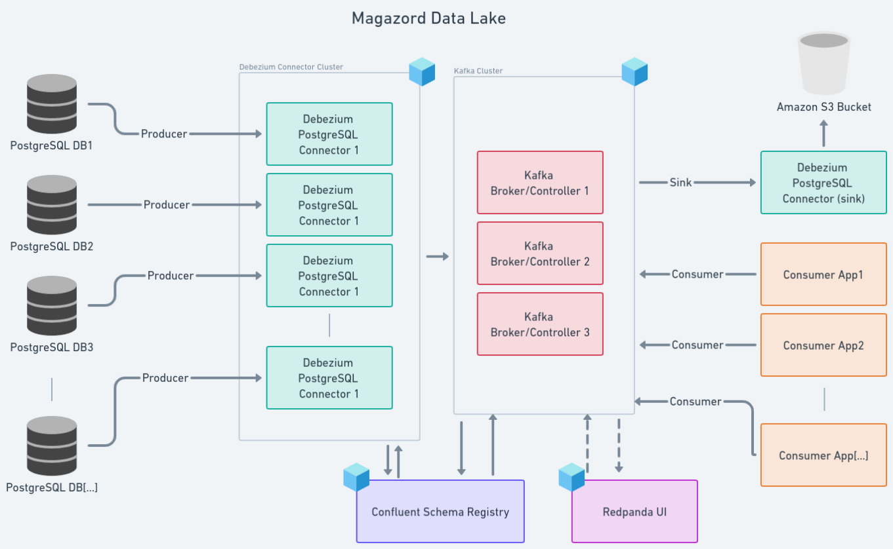

<p align="center">
  <a href="" rel="noopener">
 </a>
</p>

<h3 align="center">Magazord Data Lake (Docker)</h3>

<div align="center">

[]()
[]()

</div>

---

<p align="center"> 📤 A Docker Compose stack created to run CDC -> Streaming -> Data Lake/Consumers infrastructure
    <br> 
</p>

## 📝 Table of Contents

- [📝 Table of Contents](#-table-of-contents)
- [🧐 About ](#-about-)
- [💭 How it works ](#-how-it-works-)
- [🏁 Getting Started ](#-getting-started-)
  - [Prerequisites](#prerequisites)
  - [Initialize Docker](#initialize-docker)
  - [Kafka](#kafka)
- [🎈 Usage ](#-usage-)
    - [Redpanda UI](#redpanda-ui)
- [⛏️ Built Using ](#️-built-using-)
- [😎 Considerations ](#-considerations-)
- [📝 To-do ](#-to-do-)
- [📚 References ](#-references-)
- [✍️ Authors ](#️-authors-)


## 🧐 About <a name = "about"></a>
 
A docker compose stack to create a CDC (Change Data Capture) infrastructure. Is based on the following containers:
- 3 Kafka brokers/controllers
- 1 Schema Registry
- 1 Custom Debezium Connect, while were added Avro serializing support and a S3 Sink connector
- 1 Redpanda UI (visual management tool)


## 💭 How it works <a name = "working"></a>

<p align="center">
 
</p>


## 🏁 Getting Started <a name = "getting_started"></a>

### Prerequisites

```
Docker Compose 1.29.1 
Docker version 24.0.4
```

Just clone and execute this steps:

### Initialize Docker

```bash
docker-compose up
```

### Kafka

Create an alternative CLUSTER_ID if needed, as shown on the docs:
https://docs.confluent.io/kafka/operations-tools/kafka-tools.html#kafka-storage-sh


## 🎈 Usage <a name = "usage"></a>

#### Redpanda UI

Manage the cluster and add connectors/topics on the UI:

http://localhost:8080

P.S.: when adding a PostgresConnector, you always need to change the plugin name from *decoderbufs* to *pgoutput*.

P.S.1: when adding a S3SinkConnector, you always need to define the AWS Region.


## ⛏️ Built Using <a name = "built_using"></a>

- [Apache Kafka](https://kafka.apache.org/) - Open source distributed event streaming platform.
- [Debezium](https://debezium.io/) - Open source distributed platform for change data capture.
- [RedPanda Console](https://github.com/redpanda-data/console) - Open source UI for data streaming.
- [Whimscal](https://whimsical.com/magazord-data-lake-LMpe2X3w7gEjhxA7LAWZuD) - Used to create this project diagram.

## 😎 Considerations <a name = "considerations"></a>

- We are using Kafka v7.4.1, with [Kraft](https://developer.confluent.io/learn/kraft/) for broker managment instead Zookeeper.
- To enable Avro Converter on Debezium, we need adittional JAR files from:
  - Avro Converter files from [Confluent Hub](https://www.confluent.io/hub/confluentinc/kafka-connect-avro-converter).  These files were also needed to add [Confluent Schema Registry](https://debezium.io/documentation/reference/2.3/configuration/avro.html#confluent-schema-registry) support. 
  - [Guava lib with all dependencies](https://jar-download.com/artifacts/com.google.guava/guava).
  - These JAR files need to be placed on `debezium_connect/libs` folder.
  - A Dockerfile (`debezium_connect/Dockerfile`) was needed to add libs and S3 connector to Debezium Connect image.
- The Confluent Schema Registry was used because it manages the table's schema evolution. Otherwise, the stream files would grow very fast.
-  In the topic item values, to make the [`before` json field](https://debezium.io/documentation/reference/2.3/tutorial.html#viewing-create-event)  to became populated (instead of `null`), the PostgreSQL table's replica identity need to be [changed to `FULL`](https://www.postgresql.org/docs/current/logical-replication-publication.html). As we don't need this info for now, the tables replication will remain in default value.
-  PostgresConnector and S3SinkConnector sample JSON files are in `debezium_connect` folder.


## 📝 To-do <a name = "to_do"></a>

- [x] Created initial Docker Compose environment.
- [x] Created a PostgresConnector to convert a table as a Kafka topic.
- [x] Added an S3 Sink Connector to write stream data on S3 buckets.
- [ ] Apply authentication between the services.
- [ ] Apply transform operations on Connectors config to centralize all tables from diferent databases in same topics (`mz_pedido`,`mz_pedido_item`...), creating a field to identify the originary client.
- [ ] Chose [a format](https://aws.amazon.com/pt/blogs/big-data/choosing-an-open-table-format-for-your-transactional-data-lake-on-aws/) to consolidate CDC stream data into S3 Bucket Data Lake.
- [ ] Add stream processing methods to ingest data into S3 Buckets as consolidated data.
- [ ] Put this scructure on AWS Cloud.


## 📚 References <a name = "references"></a>

- [Integração de dados em tempo real do Postgres para o S3 com Debezium](https://medium.com/data-hackers/integra%C3%A7%C3%A3o-de-dados-em-tempo-real-do-postgres-para-o-s3-com-debezium-65b0ac97bdb2)
- [Comparativo de Hudi, Ice Berg e Delta Lake para Plataformas Modernas de Dados
](https://medium.com/@bernardo.costa/comparativo-de-hudi-ice-berg-e-delta-lake-para-plataformas-modernas-de-dados-b0077c82d2df)
- [Intro to the Iceberg Kafka Connect Sink](https://www.linkedin.com/pulse/intro-iceberg-kafka-connect-sink-tabular-io/)

## ✍️ Authors <a name = "authors"></a>

- [@almir-magazord](https://github.com/almir-magazord)