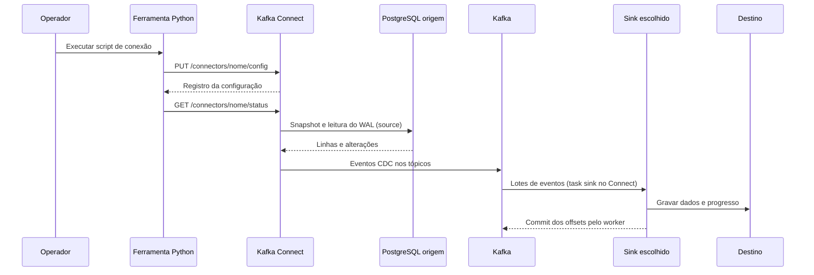

# 🏗️ Arquitetura e serviços

[🏠 Início](../README.md) · [Dados](DADOS.md) · [Conectores](CONECTORES.md) · [Operação](OPERACAO.md) · [Desenvolvimento](DESENVOLVIMENTO.md) · [Validação](VALIDACAO.md)

## Navegação nesta página

[Fluxo](#fluxo) · [Serviços](#servicos) · [Kafka](#kafka) · [Connect](#connect) · [Persistência](#persistencia) · [Entrega e replay](#entrega) · [Limites](#limites)

## Fluxo de dados e plano de controle

Python envia os JSONs à API REST do Kafka Connect. Esses scripts configuram os conectores e aguardam seu estado; o worker Connect executa a transferência dos registros.

Cada destino tem conector e grupo de consumo próprios. Registrar S3 não ativa Iceberg; registrar Iceberg não ativa o espelho PostgreSQL. O catálogo Iceberg depende do serviço PostgreSQL destino, mesmo se o sink relacional estiver desativado.

[↑ Navegação](#menu)

## Responsabilidade dos serviços

As definições completas estão em [compose.yaml](../compose.yaml).

| Serviço | Responsabilidade | Preparação / dependência |
|---|---|---|
| `postgres` | Origem das tabelas de negócio | PostgreSQL com WAL lógico e schema inicial |
| `postgres-destino` | Espelho relacional e catálogo Iceberg | Mesmo schema de negócio, volume separado |
| `kafka` | Broker ID 1 e controller KRaft | Log persistente e listeners internos/externos |
| `kafka2` | Broker ID 2 | Participa do cluster controlado pelo nó 1 |
| `connect` | Worker distribuído Kafka Connect | Imagem Debezium + plugin Java de sinks + rpk |
| `minio` | Serviço compatível com API S3 | Binário compilado no Dockerfile; armazenamento persistente |
| `redpanda-console` | Interface de tópicos, grupos e conectores | Consulta os dois brokers e a REST API do Connect |
| `kafka-replicate` | Adequar tópicos existentes à replicação 2 | Execução pontual; saída 0 indica conclusão |
| `tools` | Executar ferramentas Python | Profile `tools`; criado sob demanda por `compose run` |

O serviço `tools` não permanece consumindo registros. O Compose não possui registro automático de conectores nem carga automática de dados.

[↑ Navegação](#menu)

## Kafka: brokers, controller e tópicos

O cluster usa Kafka em modo KRaft, sem ZooKeeper. `kafka` executa os papéis `broker,controller`; `kafka2` executa apenas `broker`. O quorum configurado contém o controller ID 1.

Os tópicos de negócio são criados pela origem com uma partição e fator de replicação 2. A SMT `RegexRouter` remove `loja_v2.public.` do nome publicado. Os tópicos internos do Connect guardam configurações, offsets da origem e status; os grupos de sinks guardam seus offsets de consumo no Kafka.

| Configuração | Valor neste projeto | Consequência |
|---|---|---|
| Brokers | IDs 1 e 2 | Duas cópias dos tópicos com replicação 2 |
| Controller | ID 1 | Dependência do primeiro nó para o plano de controle |
| Partições padrão de negócio | 1 | Ordem dos eventos dentro da partição |
| `min.insync.replicas` | 1 | Pode permitir gravação com uma réplica disponível, conforme o cliente |
| Réplicas dos tópicos internos do Connect | 2 | Configurado por `CONNECT_*_STORAGE_REPLICATION_FACTOR` |

O script [replicate.sh](../connectors/docker/kafka/replicate.sh) descreve as partições, identifica réplicas diferentes de `{1,2}`, executa a reatribuição e aguarda sua conclusão. Não apaga os logs. Se todas já têm duas réplicas, termina sem executar uma nova reatribuição. A verificação do ISR é feita por `verify.py`.

Tópicos históricos `loja.public.*`, se presentes, não são renomeados ou removidos pela SMT. Novos eventos da origem atual usam os nomes limpos. O heartbeat usa seu próprio tópico técnico.

[↑ Navegação](#menu)

## Kafka Connect e Debezium

O worker usa a imagem `quay.io/debezium/connect:3.3.2.Final`, com plugins instalados durante o build. Debezium lê o PostgreSQL; o plugin `br.com.estudo.connect.CdcSinkConnector` fornece os três destinos.

O Compose define o grupo `estudo-connect` e os tópicos `connect-configs`, `connect-offsets` e `connect-status`. Cada conector recebe sua configuração pela REST API. Os nomes `loja-source`, `s3-parquet-sink`, `iceberg-sink` e `postgres-sink` são usados também pelas ferramentas de verificação.

Os JSONs configuram `JsonConverter` com schemas habilitados. Os sinks recebem o envelope CDC como `Struct`; ele é convertido em registros tipados pelo plugin. Valores nulos de Kafka são ignorados. A origem atual desativa tombstones de DELETE e envia a operação `d` com a imagem anterior da linha.

O Redpanda Console aponta para essa mesma API em [config.yaml](../connectors/docker/console/config.yaml). Os três destinos são conexões nativas do tipo `sink`, visíveis junto à origem `source`.

[↑ Navegação](#menu)

## Persistência e inicialização

| Volume | Conteúdo |
|---|---|
| `postgres-data` | Dados da origem, publicação e slots de replicação |
| `target-data` | Tabelas destino, inbox e catálogo JDBC Iceberg |
| `kafka-data` | Logs do broker 1 e dados locais do controller |
| `kafka2-data` | Logs do broker 2 |
| `minio-data` | Parquet diário, dados Iceberg e seus arquivos de metadata |

O Compose aplica o prefixo do projeto `kafka-estudo` aos nomes físicos dos volumes. O [schema SQL](../sql/schema.sql) é executado pelo entrypoint PostgreSQL somente na inicialização de um diretório de dados vazio. Editar esse SQL não altera um banco existente.

`docker compose down` preserva os volumes. Um novo `up` retoma dados e conectores registrados. `docker compose down -v` remove os volumes desse projeto e perde esses dados.

O catálogo e os arquivos Iceberg devem ser preservados em conjunto: o catálogo mantém os ponteiros, enquanto MinIO mantém os dados, manifests e metadata.

[↑ Navegação](#menu)

## Entrega, idempotência e replay

O worker confirma offsets após o processamento dos lotes e a execução de `flush`. Uma falha pode causar a releitura de eventos. A identidade utilizada para deduplicação é `(tópico, partição, offset)`.

| Sink | Proteção implementada | Limite |
|---|---|---|
| Parquet | Une o arquivo existente com o lote e deduplica pela identidade Kafka | Um escritor; regravação integral do arquivo diário |
| Iceberg | Guarda offsets por tópico/partição na propriedade `cdc.offsets`, junto ao commit dos dados | Um escritor; progresso depende de entrega ordenada por partição |
| PostgreSQL | PK da inbox impede reinserir o mesmo evento; aplicação usa transações e savepoints | O offset pode estar confirmado enquanto uma FK ainda aguarda aplicação |

No PostgreSQL, a recepção durável e a atualização das tabelas são etapas diferentes. A task pode confirmar um evento recebido na inbox antes de ele aparecer na tabela final; a verificação exige que todas as pendências sejam resolvidas.

A deduplicação é baseada na identidade Kafka, não no ID de negócio. Recriar um tópico com o mesmo nome e offsets reiniciados, ou apagar os destinos sem coordenar seus offsets, exige um procedimento de recuperação próprio. O laboratório não oferece uma operação automática de restauração completa.

[↑ Navegação](#menu)

## Decisões e limites

| Decisão | Motivo | Implicação |
|---|---|---|
| Dois brokers e um controller | Topologia solicitada para estudo | Não representa alta disponibilidade de controller |
| Plugin próprio de sinks | Layout diário exato, histórico Iceberg e preservação de FKs | Específico dos cinco schemas, sem evolução automática |
| Uma task por destino | Evitar escrita concorrente no mesmo arquivo/tabela | Escala limitada a um escritor |
| Arquivo Parquet único por dia | Manter `ano/mes/dia.parquet` | Custo de leitura/memória/regravação cresce ao longo do dia |
| Histórico nos formatos analíticos | Preservar as operações CDC | Uma entidade pode ter várias versões e um evento DELETE |
| Espelho relacional no destino | Consultar o estado atual como na origem | Convergência eventual entre tabelas, sem transação global da origem |
| Catálogo JDBC compartilhando PostgreSQL destino | Reduzir serviços necessários | Iceberg também depende desse banco |

O plugin não implementa DLQ, migração automática de schema ou gerenciamento de compactação/expiração dos snapshots. Falhas não recuperáveis deixam a task em `FAILED` para diagnóstico. As conexões e portas são de um laboratório local, sem configuração de TLS/SASL.

[↑ Navegação](#menu) · [🏠 Início](../README.md)
