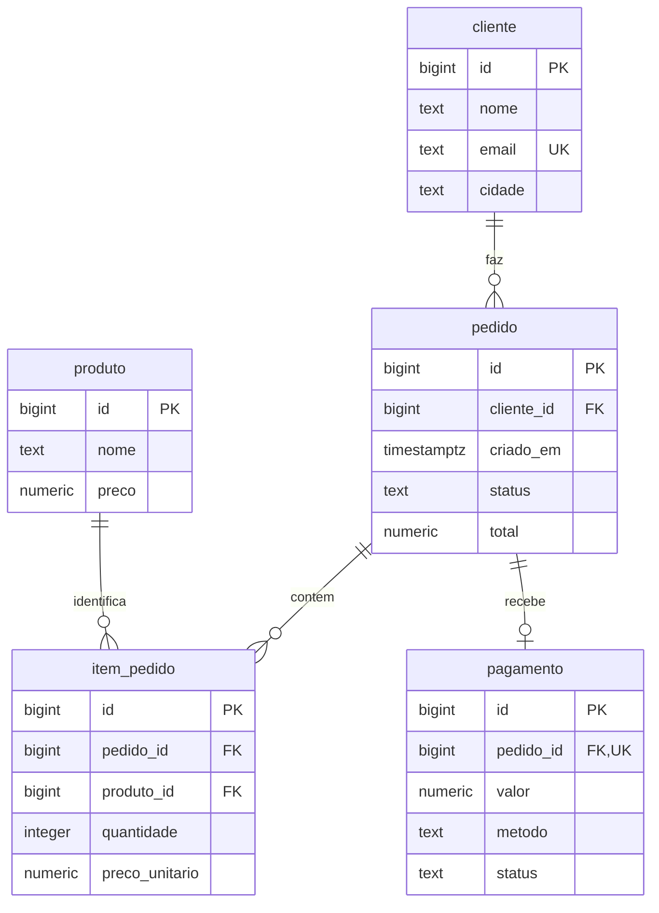

# 🗃️ Modelo relacional e eventos CDC

[🏠 Início](../README.md) · [Arquitetura](ARQUITETURA.md) · [Conectores](CONECTORES.md) · [Operação](OPERACAO.md) · [Desenvolvimento](DESENVOLVIMENTO.md) · [Validação](VALIDACAO.md)

<a id="menu"></a>
## Navegação nesta página

[Relacionamentos](#relacionamentos) · [Dicionário](#dicionario) · [Carga fake](#carga) · [Mutações](#mutacoes) · [CDC](#cdc) · [Histórico e estado atual](#historico) · [Consultas SQL](#consultas)

<a id="relacionamentos"></a>
## Relacionamentos

[sql/schema.sql](../sql/schema.sql) é compartilhado pelos dois serviços PostgreSQL. Todas as colunas de negócio são obrigatórias; cada tabela tem uma PK `BIGINT` em `id`.



A carga de exemplo cria pelo menos um item e exatamente um pagamento por pedido. O schema permite que um pedido ainda não tenha itens ou pagamento; a FK e a unicidade garantem as referências e, para pagamento, no máximo um registro por pedido.

[↑ Navegação](#menu)

<a id="dicionario"></a>
## Dicionário de dados

### `public.cliente`

| Coluna | Tipo | Regra / significado |
|---|---|---|
| `id` | `BIGINT` | PK; identificador do cliente |
| `nome` | `TEXT` | Nome gerado pelo Faker |
| `email` | `TEXT` | Único; endereço fictício com domínio `example.test` |
| `cidade` | `TEXT` | Cidade do cliente |

### `public.produto`

| Coluna | Tipo | Regra / significado |
|---|---|---|
| `id` | `BIGINT` | PK |
| `nome` | `TEXT` | Nome do produto |
| `preco` | `NUMERIC(12,2)` | Preço positivo |

### `public.pedido`

| Coluna | Tipo | Regra / significado |
|---|---|---|
| `id` | `BIGINT` | PK |
| `cliente_id` | `BIGINT` | FK para `cliente.id`; índice dedicado |
| `criado_em` | `TIMESTAMPTZ` | Data de criação do negócio |
| `status` | `TEXT` | `criado`, `pago` ou `cancelado` |
| `total` | `NUMERIC(12,2)` | Total não negativo |

### `public.item_pedido`

| Coluna | Tipo | Regra / significado |
|---|---|---|
| `id` | `BIGINT` | PK |
| `pedido_id` | `BIGINT` | FK para `pedido.id`; índice dedicado |
| `produto_id` | `BIGINT` | FK para `produto.id`; índice dedicado |
| `quantidade` | `INTEGER` | Quantidade positiva |
| `preco_unitario` | `NUMERIC(12,2)` | Preço positivo usado no pedido |

A combinação `(pedido_id, produto_id)` é única. O mesmo produto não aparece duas vezes em linhas distintas do mesmo pedido.

### `public.pagamento`

| Coluna | Tipo | Regra / significado |
|---|---|---|
| `id` | `BIGINT` | PK |
| `pedido_id` | `BIGINT` | FK e UNIQUE para `pedido.id` |
| `valor` | `NUMERIC(12,2)` | Valor positivo |
| `metodo` | `TEXT` | `pix`, `cartao` ou `boleto` |
| `status` | `TEXT` | `pendente`, `aprovado` ou `estornado` |

As FKs não declaram `ON DELETE CASCADE`. Para excluir uma entidade referenciada, primeiro remova seus registros dependentes. O schema não impõe por constraint a igualdade entre total do pedido, soma dos itens e valor pago; o gerador produz essa consistência.

Todas as tabelas usam `REPLICA IDENTITY FULL`, permitindo que UPDATE e DELETE incluam a imagem anterior completa no CDC.

[↑ Navegação](#menu)

<a id="carga"></a>
## Carga determinística de dados fake

[seed.py](../app/seed.py) usa Faker `pt_BR`, semente 42, aritmética `Decimal` e uma transação PostgreSQL. Insere os pais antes dos filhos.

| Tabela | Quantidade padrão |
|---|---:|
| Cliente | 1.000 |
| Produto | 100 |
| Pedido | 10.000 |
| Item de pedido | 20.084 |
| Pagamento | 10.000 |
| **Total** | **41.184** |

Cada pedido tem de um a três produtos distintos e quantidades de um a quatro. Os preços ficam entre 1,00 e 1.000,00. Os pedidos são gerados com status `pago`, pagamentos `aprovado` e datas a partir de 01/01/2025 UTC, em incrementos de um minuto por ID.

```bash
docker compose run --rm tools python seed.py
# Outra escala para um banco de estudo novo:
docker compose run --rm -e ORDERS=1000 tools python seed.py
```

`ORDERS` deve ser positivo; clientes e produtos mantêm suas quantidades fixas. As inserções usam `ON CONFLICT DO NOTHING`: repetir a carga não sobrescreve registros existentes nem restaura alterações feitas por `mutate.py`. Reduzir `ORDERS` não remove pedidos já gravados.

[↑ Navegação](#menu)

<a id="mutacoes"></a>
## Simulação de INSERT, UPDATE e DELETE

[mutate.py](../app/mutate.py) executa:

| Operação | Alteração |
|---|---|
| INSERT | Cliente `9000001`, caso ainda não exista |
| UPDATE | Cidade do cliente `1` para `Recife` |
| INSERT | Produto temporário `9000001` |
| DELETE | Exclusão desse produto em transação posterior |

```bash
docker compose run --rm tools python mutate.py
```

A primeira execução acrescenta um cliente ao estado final. O produto temporário gera histórico de criação e exclusão, mas não permanece na tabela destino. Em repetições, o INSERT do cliente pode ser ignorado; as quantidades de eventos dependem do que já existe e de quando a origem foi conectada.

[↑ Navegação](#menu)

<a id="cdc"></a>
## Envelope e metadados CDC

Os eventos Kafka usam JSON com `schema` e `payload`, pois os converters têm schemas habilitados. O `payload` contém `before`, `after`, `source`, `op` e timestamps do Debezium.

| `op` | Significado | Linha usada no histórico |
|---|---|---|
| `r` | Leitura do snapshot | `after` |
| `c` | INSERT | `after` |
| `u` | UPDATE | `after`; `before` conserva a versão anterior |
| `d` | DELETE | `before`; `after` é nulo |

As colunas abaixo são adicionadas somente nos registros analíticos Parquet/Iceberg:

| Campo | Tipo lógico | Uso |
|---|---|---|
| `_topic` | String | Tópico de origem |
| `_partition` | Inteiro | Partição Kafka |
| `_offset` | Long | Posição do evento na partição |
| `_op` | String | `r`, `c`, `u` ou `d` |
| `_event_time` | Timestamp UTC | `source.ts_ms`, com fallback para `ts_ms` quando ausente/zero |
| `_deleted` | Boolean | Verdadeiro para DELETE |
| `_before` | String JSON | Imagem anterior, ou a string `null` |
| `_after` | String JSON | Imagem posterior, ou a string `null` |

Decimais são preservados como `DECIMAL(12,2)` nos formatos analíticos. O campo de criação do pedido e `_event_time` são timestamps UTC com precisão de microssegundos no schema; `_event_time` é construído a partir de milissegundos CDC.

O dia do arquivo Parquet vem do evento CDC no fuso `America/Sao_Paulo`. O dia da partição Iceberg é UTC. Nenhum desses dias é calculado a partir de `pedido.criado_em`; um pedido fictício de 2025 pode gerar um evento em 2026.

[↑ Navegação](#menu)

<a id="historico"></a>
## Histórico analítico e estado relacional

| Etapa | Histórico Parquet / Iceberg | PostgreSQL destino |
|---|---|---|
| Criar um cliente | Acrescenta evento `c` | Cria a linha em `public.cliente` |
| Alterar sua cidade | Acrescenta evento `u` | Atualiza a mesma linha |
| Excluir o cliente, sem dependentes | Acrescenta evento `d` | Remove a linha |

Parquet e Iceberg podem conter várias versões do mesmo `id`. A unicidade de evento é tópico/partição/offset. O PostgreSQL destino mantém somente o estado atual, em tabelas iguais às da origem, sem colunas `_op` ou `_offset` adicionadas às tabelas de negócio.

[↑ Navegação](#menu)

<a id="consultas"></a>
## Consultas SQL para DBeaver

Execute a mesma consulta na origem e no destino para comparar o estado atual:

```sql
SELECT 'cliente' AS tabela, count(*) AS registros FROM public.cliente
UNION ALL SELECT 'produto', count(*) FROM public.produto
UNION ALL SELECT 'pedido', count(*) FROM public.pedido
UNION ALL SELECT 'item_pedido', count(*) FROM public.item_pedido
UNION ALL SELECT 'pagamento', count(*) FROM public.pagamento;

SELECT p.id, c.nome, p.criado_em, p.status, p.total,
       pg.metodo, pg.status AS status_pagamento
FROM public.pedido p
JOIN public.cliente c ON c.id = p.cliente_id
LEFT JOIN public.pagamento pg ON pg.pedido_id = p.id
ORDER BY p.id
LIMIT 20;

SELECT ip.pedido_id, pr.nome, ip.quantidade,
       ip.preco_unitario, ip.quantidade * ip.preco_unitario AS subtotal
FROM public.item_pedido ip
JOIN public.produto pr ON pr.id = ip.produto_id
WHERE ip.pedido_id = 1;
```

Somente no destino, após registrar o sink PostgreSQL:

```sql
SELECT count(*) AS eventos_pendentes
FROM cdc.inbox
WHERE NOT applied;
```

Para consultar as tabelas Iceberg, use [query_iceberg.py](../app/query_iceberg.py). A conexão PostgreSQL no DBeaver acessa o catálogo e o espelho relacional; não lê diretamente os registros Parquet do warehouse.

[↑ Navegação](#menu) · [🏠 Início](../README.md)
